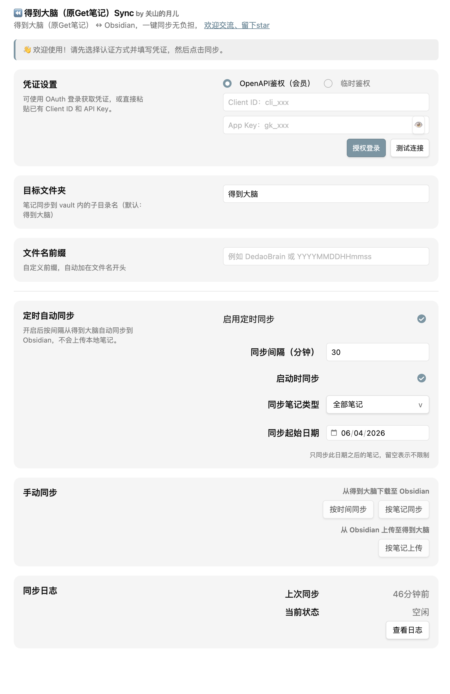
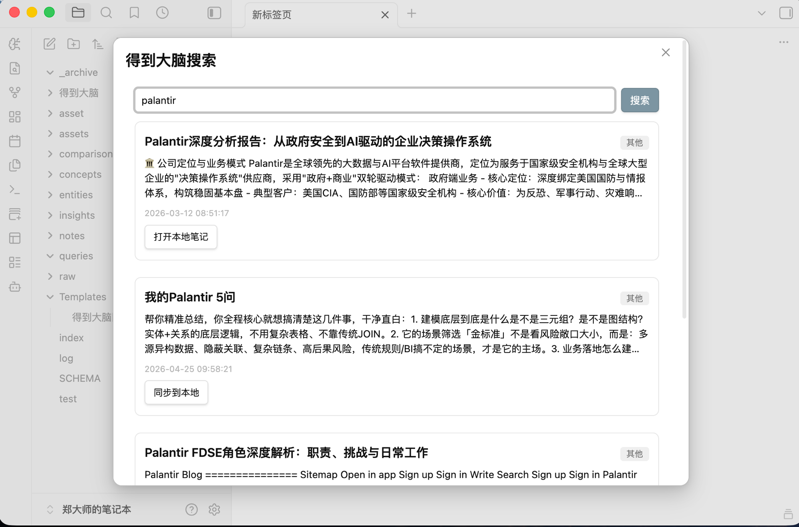

# Dedao Brain Sync

[中文](./README.md) | [English](./README_EN.md)

[](https://community.obsidian.md/plugins/dedao-brain-sync)
[](https://github.com/AndyZhengyan/obsidian-dedao-brain-sync/releases)
[](https://community.obsidian.md/plugins/dedao-brain-sync)
[](https://github.com/AndyZhengyan/obsidian-dedao-brain-sync/actions)
[](LICENSE)

Bidirectionally sync your notes, highlights, links, recordings, and AI summaries from Dedao Brain (得到大脑, formerly GetNote / Get笔记) into Obsidian as local Markdown files you can organize, search, and link over the long term.


* * *

## 🎉 1.4.0 — Latest Update

- **🔍 OpenAPI search sidebar**: Search Dedao Brain notes from the Obsidian sidebar and one-click "Open local note" or "Sync to local" from each hit. Per-item syncing state is isolated, so entries never block each other.
- **📝 Template files for new notes**: Use a custom template to generate frontmatter and body for newly synced notes.
- **🔗 Save link original content**: Link-type notes also save the original web page body for offline reading.
- **🛡️ Conservative download policy**: Locally existing notes are skipped by default and never overwritten. Delete the local file and re-sync to re-pull a remote note.
- **♻️ Recreate locally missing notes**: When a remote note still exists but its local file is gone, the plugin recreates it automatically.
- **✨ Sync modal and settings polish**: Knowledge-base sync modal rework, attachment master toggle fix, tag management improvements, and scheduled sync settings aggregation from 1.3.1 ship together.

The README keeps only the current release highlights. See [GitHub Releases](https://github.com/AndyZhengyan/obsidian-dedao-brain-sync/releases) for the complete version history.

* * *

## Why it works

- **True bidirectional sync**: Pull notes from Dedao Brain into Obsidian, and manually upload selected local Markdown files back to Dedao Brain.
- **Not a one-shot export**: The official export is offline HTML. This plugin syncs each note into its own Markdown file and keeps updating it over time.
- **Stable, resumable sync**: Supports incremental sync, sync by date, sync by note, sync by knowledge base, scheduled sync, startup sync, and checkpoints.
- **Richer filters**: Control each run by updated time, start date, max days, note types, tags, manually selected notes, or selected knowledge bases.
- **Two auth modes**: PRO users can use long-term OpenAPI auth; Temporary Auth reuses the signed-in web session for quick trials.
- **Detailed sync logs**: Keep recent runs with method, parameters, filters, duration, status, and per-note created / updated / skipped / failed details.
- **Readable files**: Notes are organized by type, named by title first, with optional date/time prefixes and frontmatter metadata.
- **Recording-friendly**: When the API returns audio and transcripts, both are saved.
- **Mobile-compatible**: Network calls use Obsidian `requestUrl`, which works on both desktop and mobile Obsidian.

## Features

| Feature | Description |
| --- | --- |
| Incremental sync | Notes missing locally are created; existing local notes are skipped by default and never overwritten. |
| Search sidebar | OpenAPI-powered full-text search of Dedao Brain from an Obsidian sidebar; one-click "Open local note" or "Sync to local" from each hit. |
| Sync by date | Pull notes from Dedao Brain by start date or "last N days". |
| Sync by note | Pick specific notes from the remote list. |
| Sync by knowledge base | Manually choose a subscribed knowledge base and sync its content locally. |
| Scheduled sync | Pull at a configurable interval with optional knowledge-base, note-type, and tag scopes. |
| Startup sync | Run a download sync once when Obsidian starts. |
| Local upload | Choose a vault folder and one or more Markdown files to manually create in Dedao Brain. |
| Two auth modes | Supports OpenAPI auth and Temporary Web auth for long-term use and quick trials. |
| Rich filters | Supports time range, last N days, checkpoints, note types, tags, selected notes, and knowledge-base scope. |
| Type-based filing | Text, link, recording, local audio, and others are filed into separate folders. |
| Sync logs | Shows each run's method, parameters, filters, processed counts, duration, and per-note results. |

## Screenshots

Settings overview: choose an auth mode, configure the target folder and scheduled sync, then run download, upload, and log actions from one place.



OpenAPI search sidebar: search Dedao Brain notes from the Obsidian sidebar and open or sync a hit to local in one click.



## Installation

### From the Obsidian Community Plugins

[](https://community.obsidian.md/plugins/dedao-brain-sync)

1. Open `Settings -> Third-party plugin -> Browse`.
2. Search for `Dedao Brain Sync`, `得到大脑`, or the legacy name `GetNote` / `Get笔记`.
3. Install and enable the plugin.

### Manual installation

1. Download `main.js`, `manifest.json`, and `styles.css` from the [latest release](https://github.com/AndyZhengyan/obsidian-dedao-brain-sync/releases/latest).
2. Put them in:

```text
<your-vault>/.obsidian/plugins/dedao-brain-sync/
```

3. Restart Obsidian and enable `Dedao Brain Sync`.

> The plugin folder name is `getnote-importer` (matching the `id` in `manifest.json` for backward compatibility with the existing listing); the repository itself has been renamed to `obsidian-dedao-brain-sync`. Legacy GetNote Importer `data.json` is migrated automatically on first startup.

## Getting API credentials

> **Note**: The Dedao Brain (得到大脑, formerly GetNote) OpenAPI requires a **Dedao Brain PRO** membership. The OpenAPI has significant operational cost, so the Dedao Brain team confirmed it is currently available to paid members only. If you are on the free tier, the OpenAPI endpoints will not return data.

Credentials are stored only in your local Obsidian plugin data, and are used to access the auth mode you select.

### OpenAPI mode (recommended for long-term use)

1. Open the Dedao Brain app.
2. Go to `Settings -> Open Platform`.
3. Create an application, then copy the `Token` and `Client ID`.
4. In `Settings -> Dedao Brain Sync`, choose `OpenAPI auth (members)` and paste both values.
5. You can also use the OAuth button on the settings page to fetch credentials automatically.

### Web mode (manual token)

If your account cannot use OpenAPI, choose `Temporary auth`. This mode reuses your existing Dedao Brain web session in the browser and does not require a `Client ID`.

Step-by-step English guide: [Web Mode Manual Token Guide](docs/web-mode-manual-token.md).

To copy the token:

1. Open `https://www.biji.com/note` in Chrome or Edge and sign in.
2. Open browser DevTools: `F12` or `Ctrl + Shift + I` on Windows / Linux; `Command + Option + I` on Mac.
3. Switch to the `Network` panel and filter by `Fetch/XHR`.
4. Reload the web app, or open the note list / any note, to trigger API requests.
5. In the request list, open one whose name looks like `notes?...` or `list?...`; the `Host` in the right-hand Headers is usually `get-notes.luojilab.com`.
6. Under `Request Headers`, copy the full `Authorization` value.
7. Paste it into the Token field under `Settings -> Dedao Brain Sync -> Temporary auth`.
8. Click `Test connection`, then run `Sync by date` or `Sync by note` once it succeeds.

The value usually starts with `Bearer eyJ...`. The plugin accepts a full `Bearer ...` string, or just the JWT token. Do not paste an OpenAPI `gk_...` token into Temporary auth. A Web token is a browser session credential and can expire; if you see `401`, `403`, or `Web Token expired`, refresh the web app and re-copy the `Authorization` header.

## Usage

### Sync from Dedao Brain to Obsidian

Click `Sync by date` on the settings page, or run the command:

```text
Dedao Brain Sync: Sync notes
```

Download sync uses a conservative default: if the same note already exists locally, the plugin skips it and does not overwrite your Obsidian content. To pull a remote note again, delete the corresponding local file and run sync again; as long as the remote note still exists, the plugin recreates it as a locally missing note.

### Pick specific remote notes

Click `Sync by note` and pick the notes you want from the remote list. Useful for topic cleanup, project reorganization, or one-off backfills.

### Sync by knowledge base

Click `Sync by knowledge base`, choose a concrete knowledge base, and sync the content under it. This is a manual entry and does not expand into scheduled sync.

### Scheduled sync

When scheduled sync is enabled, the plugin pulls from Dedao Brain at the configured interval. Scheduled sync only downloads remote changes and never uploads local notes.

### Upload from Obsidian to Dedao Brain

In the `Upload from Obsidian to Dedao Brain` area of the settings page, click `Upload by note`, pick a local folder, and select one or more Markdown files.

Upload is **create-only sync**:

- Notes with empty bodies are skipped.
- Notes that already have a `uid` and are confirmed to exist remotely are skipped, to avoid duplicates.
- Existing content in Dedao Brain is never overwritten.
- Upload is never triggered automatically by scheduled sync.

## Output layout

By default, notes are written into the target folder.

```text
vault/
└── 得到大脑/
    ├── 纯文本/
    │   └── Meeting Notes.md
    ├── 链接笔记/
    │   └── 2026-04-30_Article Highlights.md
    ├── 录音长录/
    │   ├── Recording Summary.md
    │   └── asset/
    │       ├── Recording Summary.mp3
    │       └── Recording Summary.md
    └── 其他/
        └── Unrecognized type.md
```

Each Markdown file is written with frontmatter; subsequent syncs use the `uid` field to recognize the same remote note.

```yaml
---
uid: "1908723638246504120"
title: "Meeting Notes"
created: 2026-04-30 12:45:24
modified: 2026-04-30 13:00:07
source: Dedao Brain
note_type: recorder_audio
tags: ["work"]
---
```

## Filename rules

| Case | Example |
| --- | --- |
| Has a title | `Meeting Notes.md` |
| No title | `This is the first paragraph.md` |
| With date prefix | `2026-04-30_Meeting Notes.md` |
| Same name, different notes | `Meeting Notes-2.md` |

Illegal characters (`\ / : * ? " < > |`) are stripped automatically.

## Filename prefix

You can prepend a date/time pattern to every filename. Available placeholders:

| Placeholder | Meaning | Example |
| --- | --- | --- |
| `YYYY` | 4-digit year | `2026` |
| `MM` | 2-digit month | `04` |
| `DD` | 2-digit day | `30` |
| `HH` | 2-digit hour (24h) | `14` |
| `mm` | 2-digit minute | `30` |
| `ss` | 2-digit second | `05` |

Examples:

| Prefix | Generated filename |
| --- | --- |
| `YYYY-MM-DD` | `2026-04-30_Meeting Notes.md` |
| `YYYYMMDD_HHmm` | `20260430_1430_Meeting Notes.md` |
| `YYYY-MM-DD` | `2026-04-30_.md` (uses body text when no title) |

The plugin substitutes placeholders with the note's `created_at` timestamp. Placeholders are case-sensitive: `mm` is minutes, `MM` is month.

## Settings

| Setting | Description | Default |
| --- | --- | --- |
| API Token | Dedao Brain Open Platform token | empty |
| Client ID | Dedao Brain Open Platform client ID | empty |
| Target folder | Sync target folder inside the vault | `得到大脑` |
| Filename prefix | Date/time prefix format, e.g. `YYYY-MM-DD` | empty |
| Auto sync range | Scheduled sync only pulls notes updated within the last N days; `0` means unlimited | `30` |
| Sync start date | Absolute start date for manual sync | empty |
| Scheduled sync | Background automatic sync toggle | off |
| Sync interval | Scheduled sync interval in minutes | `30` |
| Startup sync | Run a sync once when Obsidian starts | on |
| Note types to sync | Restrict which note types this sync method handles | all types |
| Sync tags | Tag whitelist; empty means sync all tags; multi-select dropdown, unmatched values can be added inline | empty |
| Scheduled sync knowledge bases | Restrict scheduled sync to selected knowledge bases; empty means no filter | empty |
| Download attachments | Master switch; disabling skips all attachment downloads | on |
| Attachment categories | Independently toggle image / audio / video / document downloads | all on |
| Reset sync checkpoint | On the scheduled sync row, reset `lastSyncEndTimestamp` so the next run starts from the configured start date | — |

## Sync model

The default download direction treats Dedao Brain as the source of truth:

1. Scan the target folder and build a `uid -> file` index from frontmatter.
2. Fetch the note list from the OpenAPI or Web API.
3. Filter by updated time, start date, max days, checkpoint, note type, selected notes, or knowledge-base scope.
4. Create files for new notes.
5. Update files when `updated_at` changes.
6. Rename files when the displayed title changes.
7. Record every note's result in the sync log.
8. Scheduled sync saves the last-processed note's timestamp as the next checkpoint.

The upload direction is manual, selective, and create-only:

1. The user picks a local folder and Markdown files.
2. The plugin parses the title, body, and frontmatter.
3. Empty bodies, notes already confirmed to exist remotely, and unsupported types are skipped.
4. Eligible content is created as a new note in Dedao Brain.
5. Upload results are added to the sync log.

## Privacy

- The plugin does not depend on any extra backend service.
- API credentials are stored in your local Obsidian plugin data.
- On download, note data is fetched from Dedao Brain and written directly to your vault.
- On manual upload, only the Markdown files you selected are sent to Dedao Brain.
- Audio attachments are only downloaded from the HTTPS URLs returned by the API.

## Known limitations

- The plugin depends on the availability and response format of the Dedao Brain OpenAPI / Web API.
- OpenAPI requires a PRO membership; Temporary auth relies on a browser session and can expire.
- Audio downloads only work when the detail endpoint returns a valid HTTPS audio attachment.
- Download sync does not overwrite the same note when it already exists locally. To pull remote content again, delete the corresponding local file first, then sync.
- Upload sync is currently create-only: it does not overwrite remote content, and it never runs automatically.
- The "Sync tags" dropdown reads from a local cache. The first time you open settings, the plugin seeds that cache from the first 20 notes; running a sync once replaces it with the full set of observed tags.

## Development

```bash
npm install
npm run typecheck
npm run lint
npm test
npm run build
```

Build artifacts are produced in the repository root:

- `main.js`
- `manifest.json`
- `styles.css`

The GitHub release workflow verifies typecheck, lint, tests, build, and tag / manifest version consistency before uploading artifacts.

## Support

- Bug reports: [GitHub Issues](https://github.com/AndyZhengyan/obsidian-dedao-brain-sync/issues)
- Feature requests: [GitHub Issues](https://github.com/AndyZhengyan/obsidian-dedao-brain-sync/issues/new/choose)
- User feedback survey: [Dedao-Brain-Sync 需求问题收集问卷](https://ku3yh6njf4.feishu.cn/share/base/form/shrcnShw4NxSTbVx7P7bjTxqvPe)

  

- If this plugin helps you, a star is appreciated

## About the author

Enterprise AI practitioner, independent AI writer, AGI believer, and AI enthusiast. Issues and feedback are welcome.


## License

[MIT](LICENSE)
