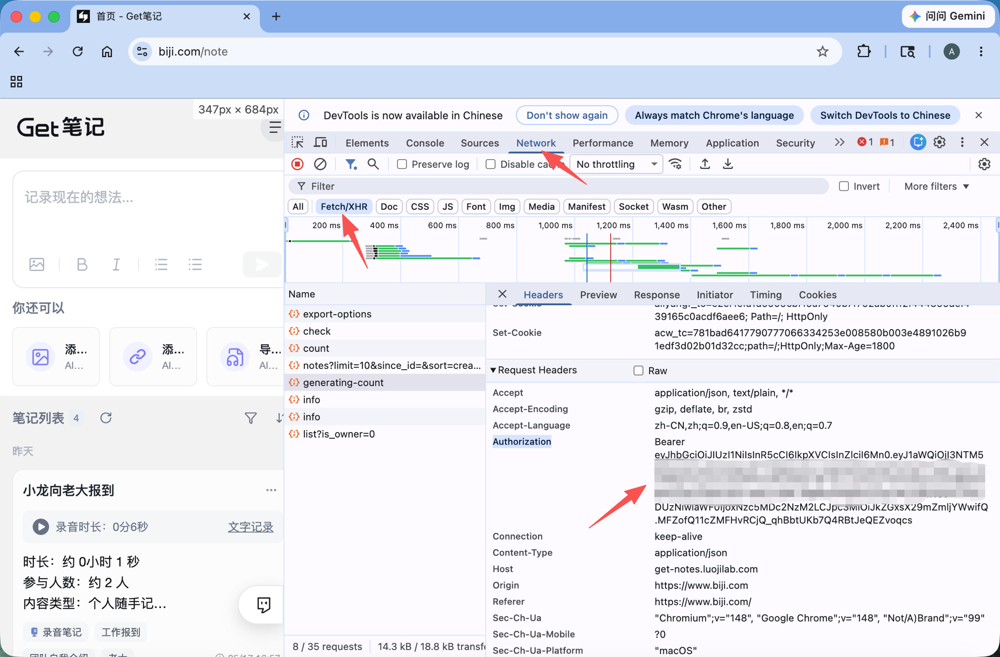

# Web Mode Token Guide

Web mode is for users who cannot use Dedao Brain OpenAPI. It reuses the signed-in Dedao Brain Web session from your browser, so it only needs the browser session `Authorization` header and does not need `Client ID`.

## When To Use It

Use Web mode when:

- OpenAPI is unavailable for your account.
- `Test Connection` reports that OpenAPI is only available for PRO members.
- You can sign in to Dedao Brain Web at `https://www.biji.com/note`.

Use OpenAPI mode instead if you already have a working `gk_...` OpenAPI token and `Client ID`.

## Automatic Token Capture On Desktop (Recommended)

1. Open `Settings -> Dedao Brain Sync`.
2. Select `Temporary auth`, then click `Sign in on the web and get Token automatically`.
3. Finish signing in inside the dedicated window opened by the plugin. The window closes after the captured token passes validation and is saved.
4. The login state is stored in a plugin-specific isolated partition, so later token refreshes can usually reuse it.
5. To sign out completely, click `Sign out and clear login`. This removes the saved token, cookies, cache, and the isolated session data.

The plugin does not read your password or SMS code and does not store cookies in plugin settings. Enter sign-in details only inside that dedicated window.

## Manually Copy The Authorization Header On Mobile

1. Open `https://www.biji.com/note` in Chrome or Edge and sign in.
2. Open browser DevTools:
   - Windows/Linux: `F12` or `Ctrl + Shift + I`
   - Mac: `⌘ + ⌥ + I` (`Command + Option + I`)
3. Select the `Network` tab.
4. Select the `Fetch/XHR` filter.
5. Stay on the Dedao Brain homepage and refresh the page so it sends API requests (no need to open the note list or any specific note).
6. Click a request whose name looks like `notes?...` or `list?...`.
7. Check the right-side `Headers` panel. The `Host` is usually `get-notes.luojilab.com`.
8. Under `Request Headers`, copy the full `Authorization` value.

The value usually starts with `Bearer eyJ...`. Keep the `Bearer ` prefix if it is copied with the token; the plugin also accepts the JWT token without the prefix.

## Paste It In Obsidian Mobile

1. Open `Settings -> 得到大脑（原Get笔记）Sync`.
2. Select `Temp Auth (Free)`.
3. Paste the copied `Authorization` value into the token input.
4. Click `Test Connection`.
5. After the connection succeeds, run `Sync by Time` or `Sync by Notes`.

## Common Mistakes

- Do not paste the OpenAPI `gk_...` token into Web mode.
- Do not copy `Cookie`, `Set-Cookie`, or `x-request-id`; Web mode needs `Authorization`.
- If no requests appear, keep DevTools open and refresh `https://www.biji.com/note`.
- If you cannot find `notes?...`, click around the note list or open any note to trigger another request.
- If `Test Connection` returns `401`, `403`, or "Web Token expired", refresh Dedao Brain Web and copy a new `Authorization` header.

## Security Notes

The Web token is a browser session credential. Treat it like a password. Do not post it in issues, screenshots, logs, or chat messages.
